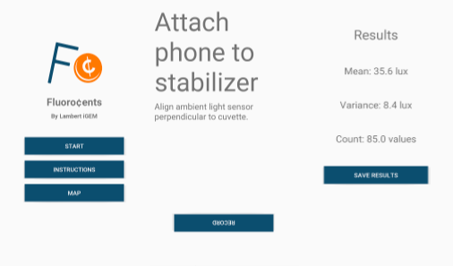
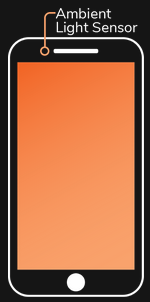
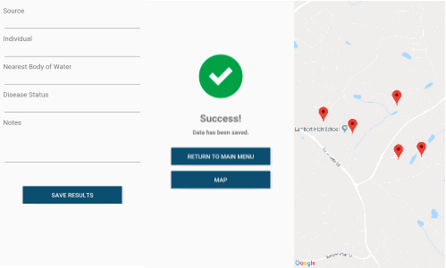
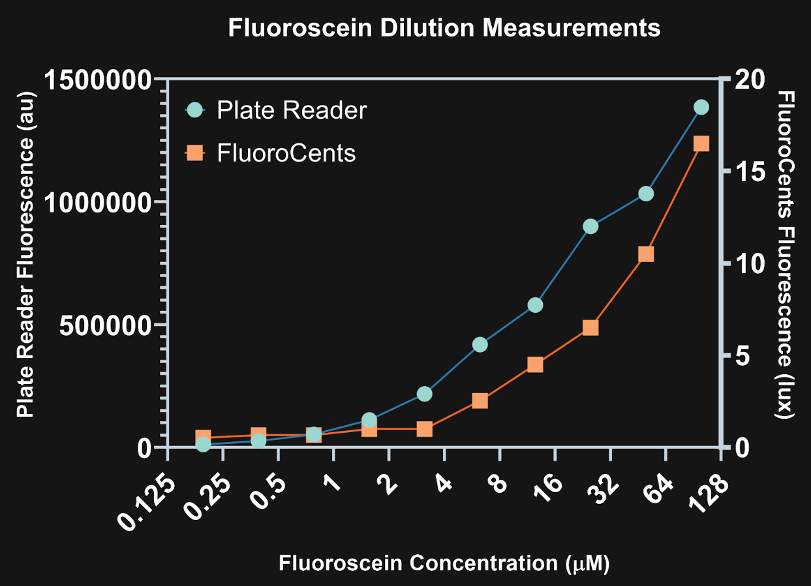

# Fluoro¢ents App

Background
---------------

In our wet lab process, the level of fluorescence in a liquid culture is correlated with the amount of C. elegans genetic material that is found within, as the toehold switch unbinds only in the presence of a target strand from C. elegans. While visual detection of fluorescence may alert health care workers to the possibility of helminthiasis diagnosis, we set out to create a more practical manner in which we could not only detect, but quantify fluorescence. Keeping in mind the standards of frugality, accessibility, and portability, we introduce FluoroCents: an ultra-low cost, 3-D printed fluorometer that can be used with ease in the field by healthcare workers. FluoroCents is the most portable fluorometer in the world - at just 7 grams, Fluorocents will provide a rapid and accessible platform for in-field detection. The physical portion of FluoroCents is a 3-D printed light excitation and filtration mechanism. But in order for the FluoroCents hardware device to function, it needs an Android phone with the FluoroCents app installed to function. 

Overview
---------------

At its base, FluoroCents provides a simple method for detecting the presence of fluorescence in a liquid culture. However, with the revolutionary FluoroCents application, our fluorometer can go beyond this simple test and provide analytics on the level of fluorescence in a sample and use this data to extrapolate information about the relative level of helminth DNA in a sample. 

<figcaption>
<b>Figure 1:</b> FluoroCents app screenshots for lux data collection over a 30-second time period
    </figcaption>

Ambient Light Sensor
---------------

The ambient light sensor is a photodetector found at the top of most smartphones. The sensor is intended to sense ambient light near the surface of the phone and dim the brightness of the phone accordingly. The ambient light sensor picks up electromagnetic energy in a limited range of wavelengths of visible light, but includes the wavelengths emitted by GFP (Pereira & Hosker, 2019). We will manipulate the sensor and phone device to collect data about luminescence emitted by fluorescent samples, giving us tangible information about the total fluorescence found in a sample. Furthermore, the prevalence of sensors within smartphones allow for an accessible mechanism for this data collection. 

<figcaption>
<b>Figure 2:</b> Ambient light sensor location on most smartphones visualized
    </figcaption>

Process
---------------

The FluoroCents Android app takes repeated measurements of the sample's lux value by capturing the reading from the ambient light sensor as changes in the lux value occur. FluoroCents was developed in Java using the Android Studio IDE. The app outputs the mean lux value and variance of the lux onto the user interface over a 30-second interval. The number of lux measurements taken during the interval is also displayed according to user preference to run trials in a scientific setting. To ensure in-field functionality, the mobile app comes with a saving mechanism that stores the results of fluorescence tests in the cloud. By utilizing Amazon Web Service's DynamoDB NoSQL database infrastructure, many data points can be recorded in one test including the following: 

    Latitude
    Longitude
    Timestamp
    Disease Status
    Name of User
    Nearest Body of Water
    Source of Sample
    Additional Notes
    
The latitude and longitude coordinates for each test can then be retrieved from the DynamoDB database and displayed within the FluoroCents Android app using Google Maps API. Each location marker for its respective test is labelled with characteristics as inputted by the user. These features make up the helminth diagnosis mapping tool (HDMT). This tool is built into the testing app and accessible on mobile phones across the globe. Healthcare workers can easily access data where helminth infections are prevalent and which areas are in immediate need of aid. On a broader scale, this enables healthcare workers to allocate resources and plan distribution pipelines in a way that is efficient and resourceful. Housing all parts of the diagnosis workflow, including the measurement of fluorescence, storage of data, and map access all in one app serves as a highly useful capability in the field. 

<figcaption>
<b>Figure 3:</b> FluoroCents app screenshots for data storage and mapping data points
    </figcaption>

      

By measuring the lux value using a phone’s ambient light sensor and our FluoroCents app, we can generate more complex information regarding the detection of a helminth organism. 

Verification of FluoroCents with a Plate Reader
---------------

As part of our testing, we wanted to verify that FluoroCents was a legitimate device to measure fluorescence by comparing it with an industrial plate reader. We wanted to graphically compare the lux measurements taken with FluoroCents to the arbitrary values from a plate reader for several two fold dilutions of the iGEM fluorescein standard.

<figcaption>
<b>Figure 4:</b> Made using GraphPad Prism. The graph shows the measurement of Fluoroscein dilutions by both a commercial plate reader and our very own FluoroCents device. This graph has a log2 x-axis.
    </figcaption>

          

With the graph of the data we collected, it was clear that there was a real correlation between lux from FluoroCents, seen on the right y-axis, and the raw fluorescence data from a plate reader, seen on the left column. This correlation to an industrial-grade instrument means that FluoroCents does have a valid claim as a fluorescence tool, giving the FluoroCents application legitimacy in the FluoroCents system. 
